# ax-boot-themes

[ax-boot-framework](https://github.com/axboot/ax-boot-framework) 사용자를 위한 테마 입니다.
다음의 테마를 이용해 당신의 애플리케이션을 보다 멋지게 만들 수 있습니다.

### 사용법

`ax-boot-framework/ax-boot-admin/src/main/resources/axboot.json` 을 다음과 같이 수정하세요.
```json
{
  "title": "AXBoot :: Advanced Web Application Development Framework",
  "copyrights": "AXBOOT 2.0.0 - Web Application Framework © 2010-2016",
  "logo": {
    "header": "/assets/images/header-logo.png",
    "login": "/assets/images/login-logo.png",
    "logo": "logo.png"
  },
  "background": {
    "login": "/assets/images/login-bg.jpg"
  },
  "layout": {
    "leftSideMenu": "visible"
  },
  "sessionCookie": "a_x_b_a_a_t_k",
  "extendedCss": [
    "/assets/css/axboot.css"
  ],
  "extendedCssforIE9": [
    "/assets/css/axboot-01.css",
    "/assets/css/axboot-02.css",
    "/assets/css/axboot-03.css"
  ]
}

```

> ie9의 경우 CSS 셀렉터의 갯수가 제한이 있어 제대로 작동하지 않는다는 이슈가 있었습니다. 그런 이유로 axboot.css를 분리된 형태로도 제공 해드립니다. 
`extendedCssforIE9` 에 넣어주시면 됩니다.

```html
<link rel="stylesheet" type="text/css" href="/assets/css/axboot.css"/>
<!--[if lt IE 10]>
    <link rel="stylesheet" type="text/css" href="/assets/css/axboot-01.css"/>
    <link rel="stylesheet" type="text/css" href="/assets/css/axboot-02.css"/>
    <link rel="stylesheet" type="text/css" href="/assets/css/axboot-03.css"/>
<![endif]-->
```
설정이 제대로 되었다면 위와 같이 소스가 빌드됩니다.

## arongi

Design by Jowrney (http://flybasket.com/)

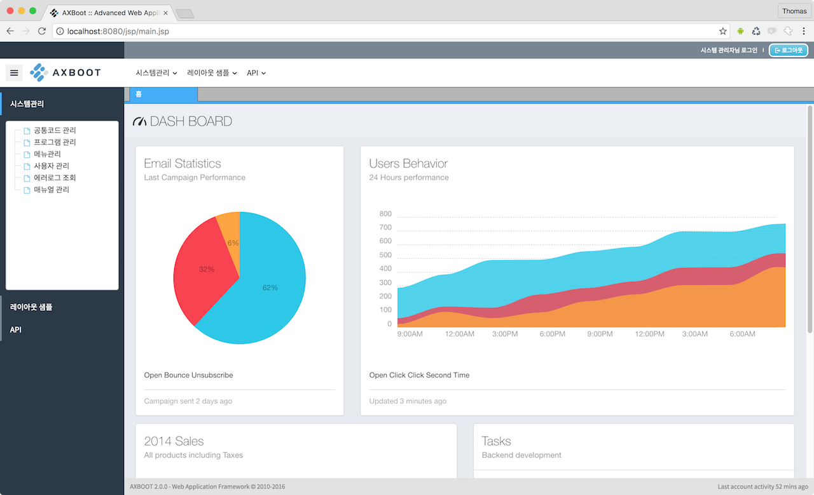
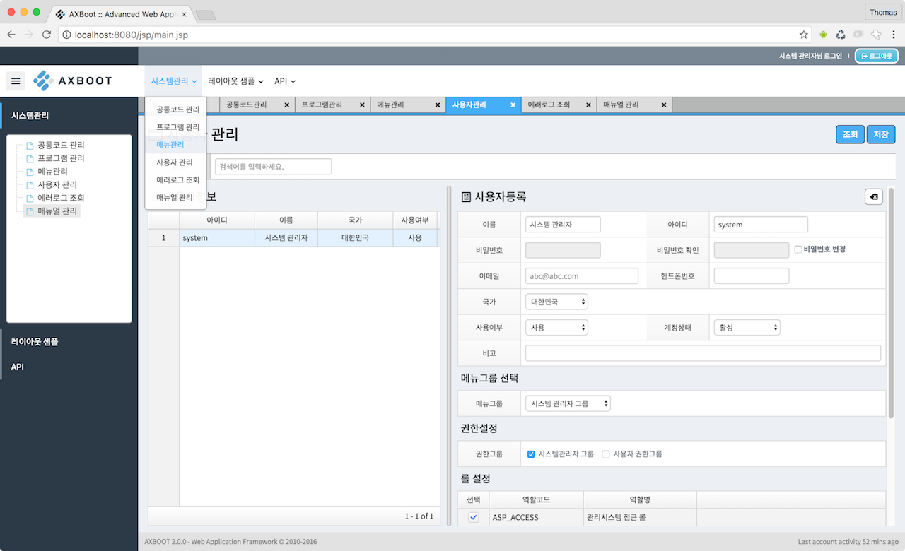
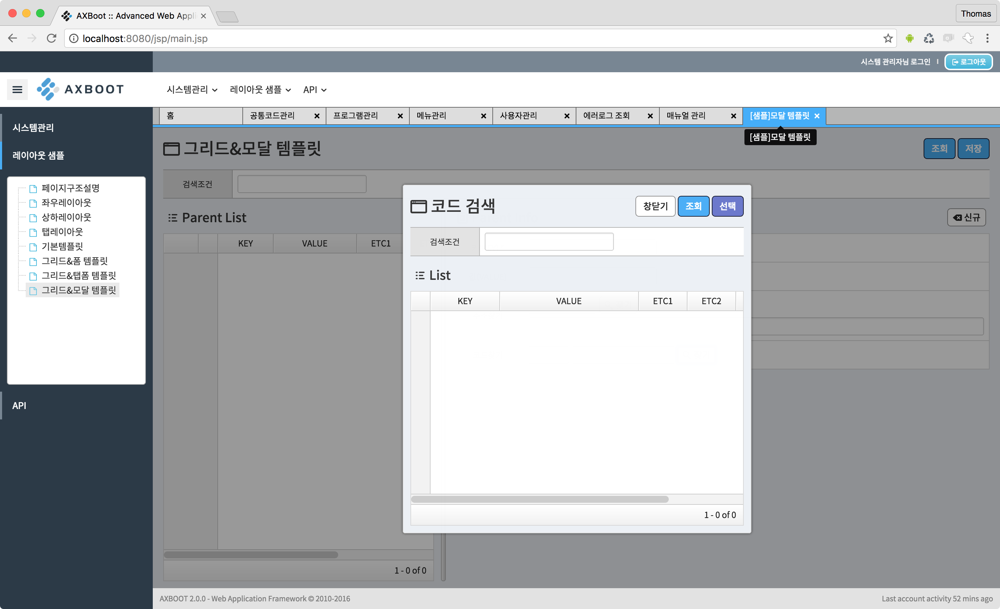
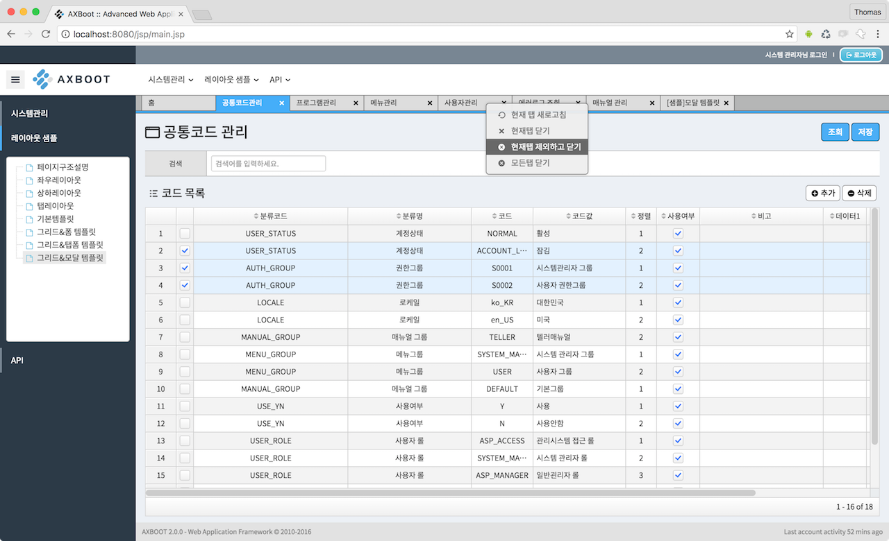

### CDN

**production**  
 - https://cdn.rawgit.com/axboot/ax-boot-themes/master/arongi/axboot.css
 - https://cdn.rawgit.com/axboot/ax-boot-themes/master/arongi/images/header-logo.png

**development**  
 - https://rawgit.com/axboot/ax-boot-themes/master/arongi/axboot.css
 - https://rawgit.com/axboot/ax-boot-themes/master/arongi/images/header-logo.png
 
 **for ie9**
 - https://cdn.rawgit.com/axboot/ax-boot-themes/master/arongi/axboot-01.css
 - https://cdn.rawgit.com/axboot/ax-boot-themes/master/arongi/axboot-02.css
 - https://cdn.rawgit.com/axboot/ax-boot-themes/master/arongi/axboot-03.css
 
## bulldog
준비중 입니다.

## cocker

Design by Thomas Jang (https://github.com/thomasjang)

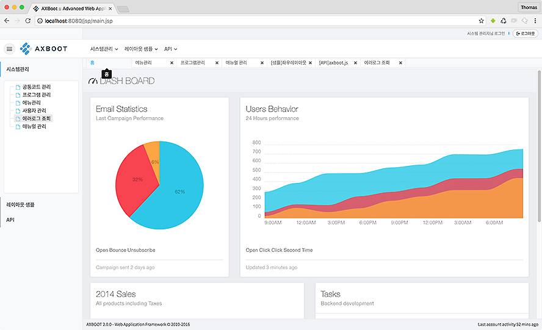
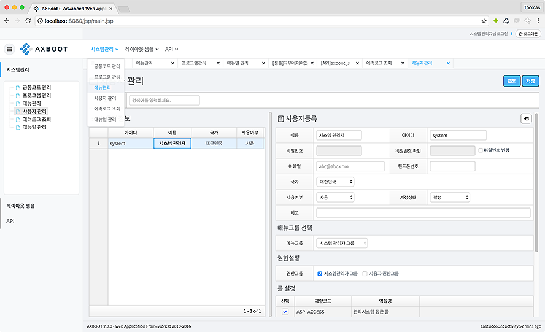
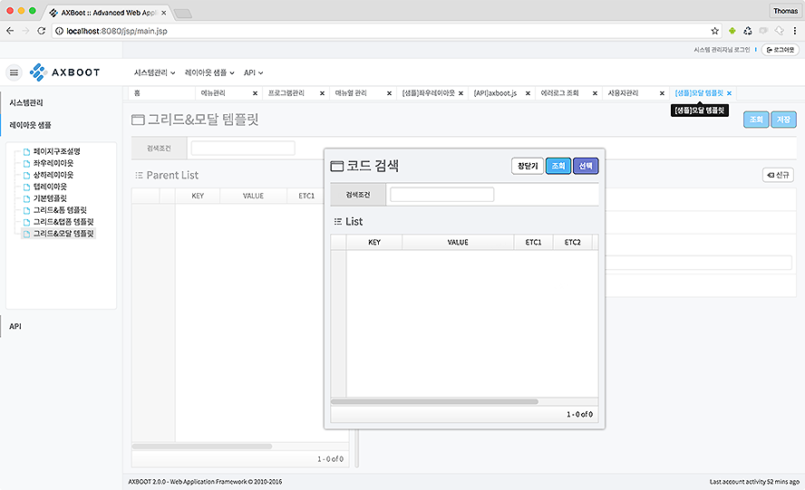
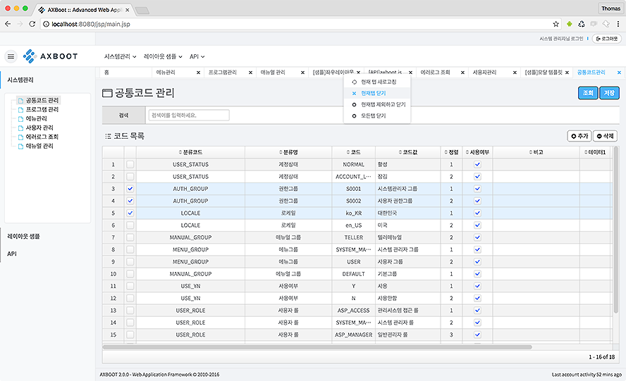

### CDN

**production**  
 - https://cdn.rawgit.com/axboot/ax-boot-themes/master/cocker/axboot.css
 - https://cdn.rawgit.com/axboot/ax-boot-themes/master/cocker/images/header-logo.png

**development**  
 - https://rawgit.com/axboot/ax-boot-themes/master/cocker/axboot.css
 - https://rawgit.com/axboot/ax-boot-themes/master/cocker/images/header-logo.png
 
 **for ie9**
 - https://cdn.rawgit.com/axboot/ax-boot-themes/master/cocker/axboot-01.css
 - https://cdn.rawgit.com/axboot/ax-boot-themes/master/cocker/axboot-02.css
 - https://cdn.rawgit.com/axboot/ax-boot-themes/master/cocker/axboot-03.css

## doberman

Design by Thomas Jang (https://github.com/thomasjang)

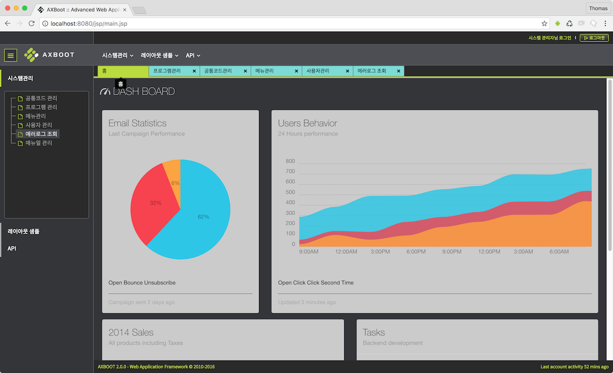
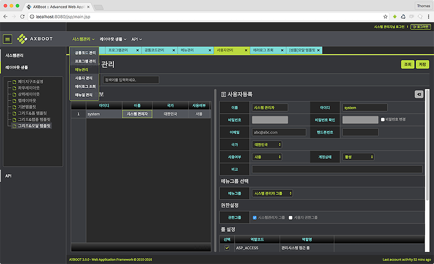

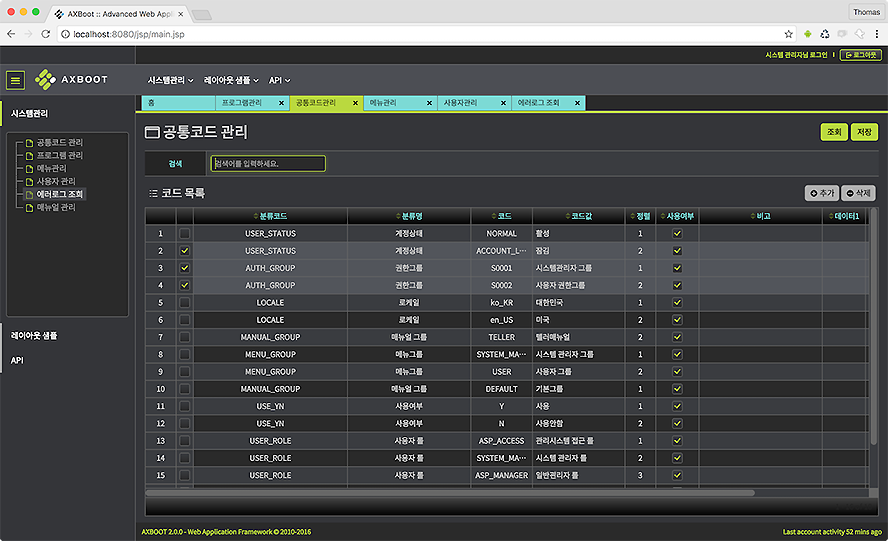

### CDN

**production**  
 - https://cdn.rawgit.com/axboot/ax-boot-themes/master/doberman/axboot.css
 - https://cdn.rawgit.com/axboot/ax-boot-themes/master/doberman/images/header-logo.png

**development**  
 - https://rawgit.com/axboot/ax-boot-themes/master/doberman/axboot.css
 - https://rawgit.com/axboot/ax-boot-themes/master/doberman/images/header-logo.png
 
 **for ie9**
 - https://cdn.rawgit.com/axboot/ax-boot-themes/master/doberman/axboot-01.css
 - https://cdn.rawgit.com/axboot/ax-boot-themes/master/doberman/axboot-02.css
 - https://cdn.rawgit.com/axboot/ax-boot-themes/master/doberman/axboot-03.css